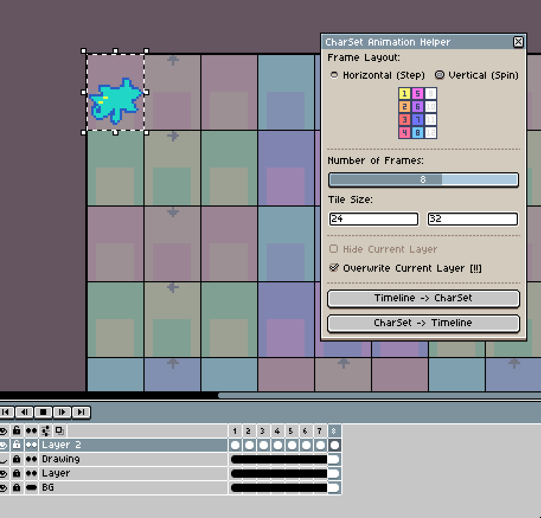
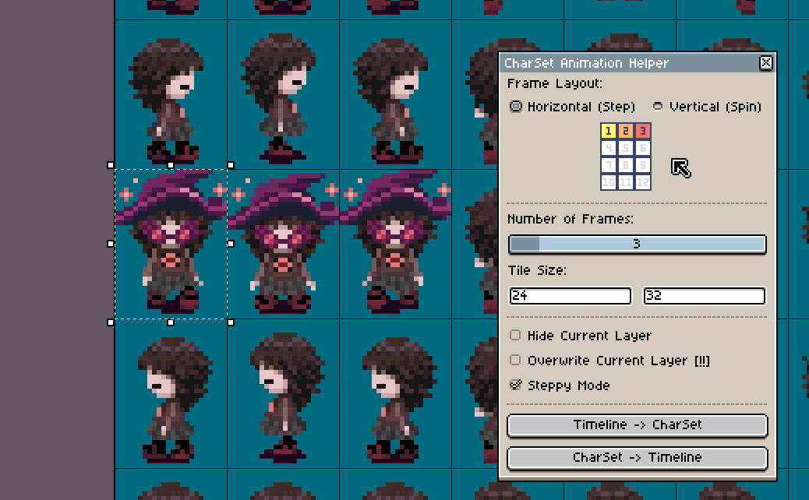
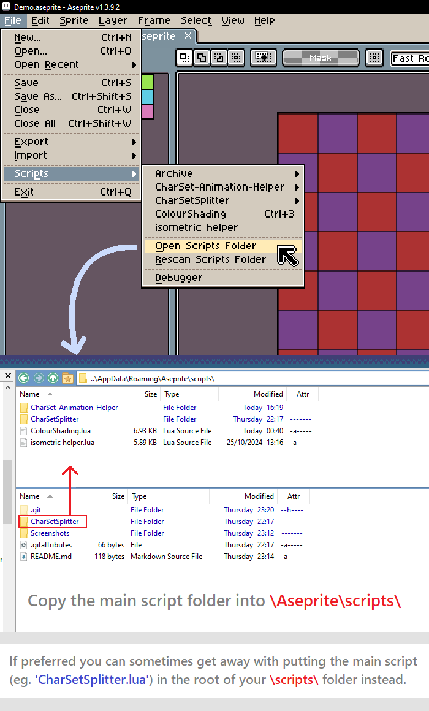

# Aseprite CharSet Animation Tool

### Switch between timeline and CharSet animations
Preview an animation using the timeline, and then arrange the frames back onto the CharSet for use in RpgMaker.  

### Steppy Mode
Turns a 3 charset frames into a 4-frame animation by repeating the 2nd frame, to preview normal walking animations.

## Script Installation

